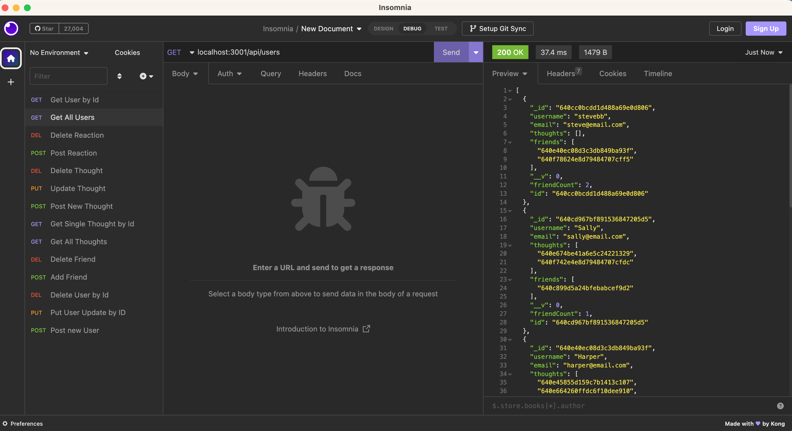

# NoSQL: Social Network API
User will use command-line application to interface with a social network platform through the NoSQL environment of Mongoose models synced to the MongoDB datatabases. 

## Description
This application utilizes a command-line initiation and Insomnia to allow users to dynamically navigate NoSQL informational datbases with an API network. When the server is initialezed using `node server.js` Mongoose models are synced to the MonogoDB database. As user navigates GET routes for users and thoughts, data is displayed in JSON format. USER can also test API for POST, PUT, and DELETE to successfully create, update and delete users and thoughts in database. Users can also test API routes for POST and DELETE of thought reactions and friends to friend's lists. When a user is deleted, all thoughts are also deleted. 

[GitHub Repo](https://github.com/kristinbrewer/social-network-NoSQL)

[Video Walk Through](https://drive.google.com/file/d/1J3-Igf04PbfU5H4R8ctI8JOzmH4H97IC/view)

## Table of Contents
- [Description](#description)
- [Installation](#installation)
- [Usage](#usage)
- [License](#license)
- [Contributing](#contributing)
- [Tests](#tests)
- [Questions](#questions)

## Installation
Node.js (v16), Express, Mongoose, Insomnia 

## Usage
Run database, initialize program with node server.js, open Insomnia to make API calls 

## License
MIT Copyright (c) 2022 kristinbrewer
Permission is hearby granted, free of charge, to any person obtaining a copy of this software and associated documentation files (the "Software"), to deal in the Software without restriction, including without limitation the rights to use, copy, modify, merge, publish, distribute, sublicense, and/or sell copies of the Software, and to permit persons to whom the Software is furnished to do so, subject to the following conditions: The above copyright notice and this permission notice shall be included in all copies or substantial portions of the Software. THE SOFTWARE IS PROVIDED ”AS IS”, WITHOUT WARRANTY OF ANY KIND, EXPRESS OR IMPLIED, INCLUDING BUT NOT LIMITED TO THE WARRANTIES OF MERCHANTABILITY, FITNESS FOR A PARTICULAR PURPOSE AND NONINFRINGEMENT. IN NO EVENT SHALL THE AUTHORS OR COPYRIGHT HOLDERS BE LIABLE FOR ANY CLAIM, DAMAGES OR OTHER LIABILITY, WHETHER IN AN ACTION OF CONTRACT, TORT OR OTHERWISE, ARISING FROM, OUT OF OR IN CONNECTION WITH THE SOFTWARE OR THE USE OR OTHER DEALINGS IN THE SOFTWARE. 

## Contributing
Kristin Brewer

## Tests
N/a

## Questions
For more information, check out my [GitHub](https://github.com/kristinbrewer).
Please email me at: brewer.kristin17@gmail.com with any additional questions. 